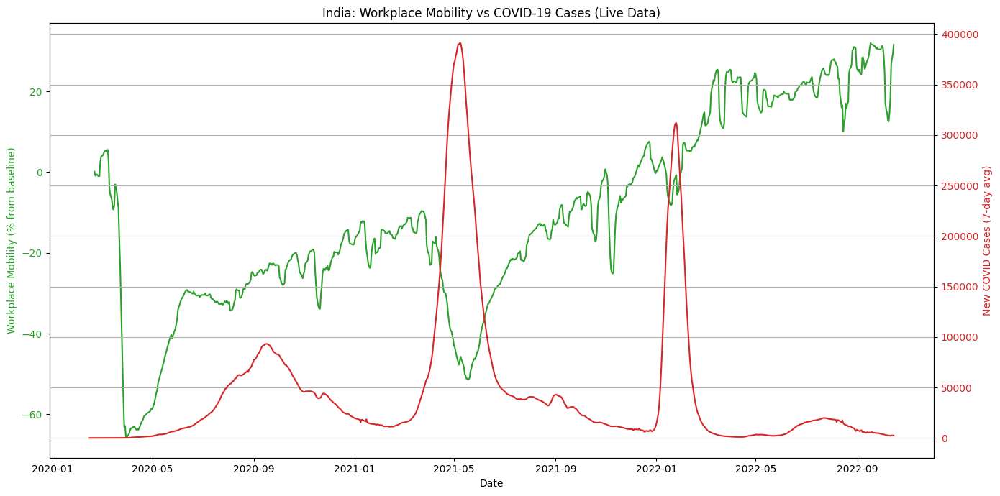

# India_covid_mobility_analysi# 🇮🇳 COVID-19 & Workplace Mobility Analysis – India

This project analyzes the correlation between COVID-19 case trends and workplace mobility in **India**, using two reliable data sources:

- **Google Global Mobility Report**
- **Johns Hopkins University COVID-19 Time Series**

---

## 📌 Overview

The aim of this project is to visualize how movement restrictions (captured by workplace mobility data) correspond to the rise and fall of COVID-19 cases in India.

The visualization helps identify the impact of government interventions, lockdowns, and behavioral changes over time.

---

## 🔧 Features

- ✅ Pulls **real-time data** from official sources using URLs
- ✅ Filters & merges datasets based on **date** and **location**
- ✅ Computes **7-day rolling averages** to smooth out daily noise
- ✅ Generates a dual-axis plot to visualize:
  - 🟢 Workplace Mobility Trends  
  - 🔴 New COVID-19 Cases (7-day average)

---

## 🛠 Tech Stack

- **Python**
- `pandas` – Data cleaning & transformation  
- `matplotlib` – Data visualization  
- `requests` – Downloading CSVs from URLs

---

## 📈 Sample Output

---

## 📁 Data Sources

- 📉 COVID-19 Data: [Johns Hopkins CSSE](https://github.com/CSSEGISandData/COVID-19)  
- 🚶 Mobility Data: [Google Mobility Reports](https://www.google.com/covid19/mobility/)

---

## 🧠 Author

Made with ❤️ during my learning journey in data analysis and visualization.  
Open for suggestions and improvements!

---

## 📜 License

This project is open-source and available under the [MIT License](LICENSE).
s_
